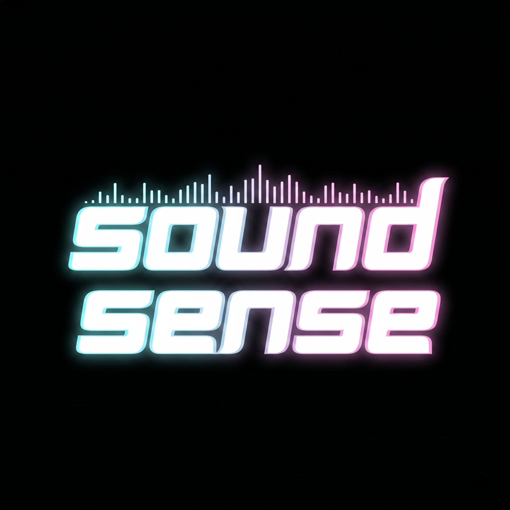

  
  <h1>SoundSense v1.2</h1>
  
SteelSeries OLED ekranlar ve ESP32 tabanlı harici donanımlar için yüksek performanslı ses görselleştirici.

  
  
  
  

---

## Genel Bakış

SoundSense, WASAPI kullanarak sistem sesini sıfır gecikmeyle yakalayan ve aynı anda birden fazla platformda (SteelSeries cihazlar ve ESP32) görselleştiren profesyonel bir C++ uygulamasıdır.

### Temel Özellikler
- **SteelSeries Entegrasyonu**: Apex serisi klavyeler (Apex 5, 7, Pro) ve SteelSeries OLED fareler için yerel destek.
- **ESP32 Harici Ekran**: Seri port (COM) üzerinden harici SSD1306 OLED ekranlara gerçek zamanlı senkronizasyon.
- **Ultra Düşük Gecikme**: Gerçek zamanlı tepki için optimize edilmiş 60 FPS işleme hattı.
- **Sahne Düzenleyici**: Sürükle-bırak katmanlar, saatler ve dalga formları ile tamamen özelleştirilebilir arayüz.
- **Sistem Tepsisi Modu**: Arka planda sessizce çalışır ve profesyonel bir tepsi menüsü sunar.
- **Otomatik Keşif**: SteelSeries cihazlarını ve kullanılabilir COM portlarını otomatik olarak algılar.

---

## Görsel Modlar

| Klasik Barlar | Ayna Modu | Nokta Modu |
|:---:|:---:|:---:|
|  |  |  |

---

## Donanım Kurulumu (ESP32)

SoundSense, görselleştirmeyi ESP32 destekli harici bir ekrana yansıtabilir.

### Donanım Gereksinimleri
- **Mikrokontrolcü**: ESP32 (S3, C3 veya standart)
- **Ekran**: SSD1306 OLED (128x64 çözünürlük önerilir)
- **Haberleşme**: 115200 Baud hızında USB-Seri bağlantı

### Haberleşme Protokolü
Masaüstü uygulaması verileri 60Hz hızında gönderir:
- **Başlık (Header)**: `0xFF` (Senkronizasyon Baytı)
- **Veri (Payload)**: 64 Bayt (Her bayt 0-255 arası bir frekans bandını temsil eder)
- **Toplam Paket Boyutu**: 65 Bayt

### Yazılım Yükleme
1. `SoundSense_IDF` klasörüne gidin.
2. ESP-IDF veya sağlanan `flash_firmware.bat` dosyasını kullanarak yazılımı yükleyin.
3. Varsayılan I2C Pinleri: `SDA: 8`, `SCL: 9` (Gerekirse `main.c` içinden değiştirilebilir).

---

## Teknik Altyapı

- **Framework**: Qt 6.11 (QML/Quick)
- **Ses API**: Windows Audio Session API (WASAPI)
- **Ağ**: GameSense API için WinHTTP
- **Dil**: C++17
- **Kurulum**: Inno Setup

---

## Kurulum ve Kullanım

1. [Resmi Yayınlar](https://github.com/Emirtopav/SoundSense/releases) bölümünden en güncel `SoundSense_Setup.exe` dosyasını indirin.
2. Uygulamayı kurun ve başlatın.
3. **SteelSeries Kullanıcıları**: SteelSeries GG uygulamasının çalıştığından emin olun. Uygulama otomatik olarak bağlanacaktır.
4. **ESP32 Kullanıcıları**: "External Hardware" sekmesinden COM portunuzu seçin ve "Connect" butonuna basın.
5. Kontrol panelini gizlemek veya göstermek için **Sistem Tepsisi İkonuna** çift tıklayın.

---

## Katkıda Bulunma
Bu projeyi fork'lamaktan ve pull request göndermekten çekinmeyin. Büyük değişiklikler için lütfen önce bir konu (issue) açarak neyi değiştirmek istediğinizi tartışın.

## Lisans
Bu proje MIT Lisansı ile lisanslanmıştır - detaylar için `LICENSE` dosyasına bakınız.

---

  <b>Developed with ❤️ by <a href="https://github.com/Emirtopav">Emir Topav (Emirtopav)</a></b>

